# PcBuilder

**PcBuilder** is a full-stack PC hardware configurator. Users build a PC by manually picking components or by auto-generating a complete build within a budget, while the backend validates real-world component compatibility through a rule engine. Finished builds can be saved to a public gallery, shared, and discussed.

Beyond the core configurator, PcBuilder includes real-time notifications, component price tracking with alerts, admin moderation tools, automated component-data scraping from online stores, and ML-based text moderation for user-generated content.

<!-- SCREENSHOT: Hero / landing — the main PC build page with components selected. Suggested filename: docs/screenshots/01-home.png -->
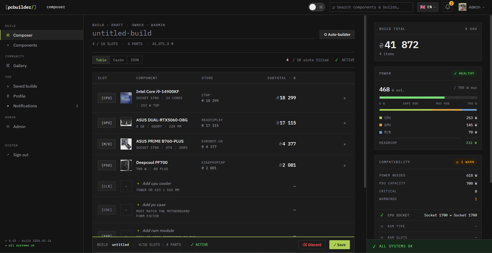

Alternatively, user can pick light theme.
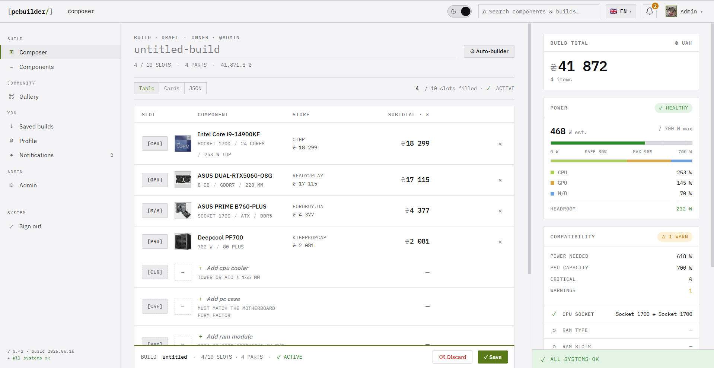

---

## Features

### PC Builder
- Manually select components slot by slot (CPU, GPU, motherboard, RAM, storage, cooler, case, fans, PSU).
- **Auto-Builder** — a greedy build generator that produces a complete, balanced PC for a given budget and usage scenario (e.g. gaming, productivity), respecting budget allocations and avoiding CPU/GPU bottlenecks.
- **Live compatibility checking** — a rule engine validates socket matches, PSU wattage headroom, case clearances, cooler height, RAM/motherboard support, bottleneck ratios, and more, surfacing issues inline as you build.
- Multiple views of a build: card view, parts table, and raw JSON.

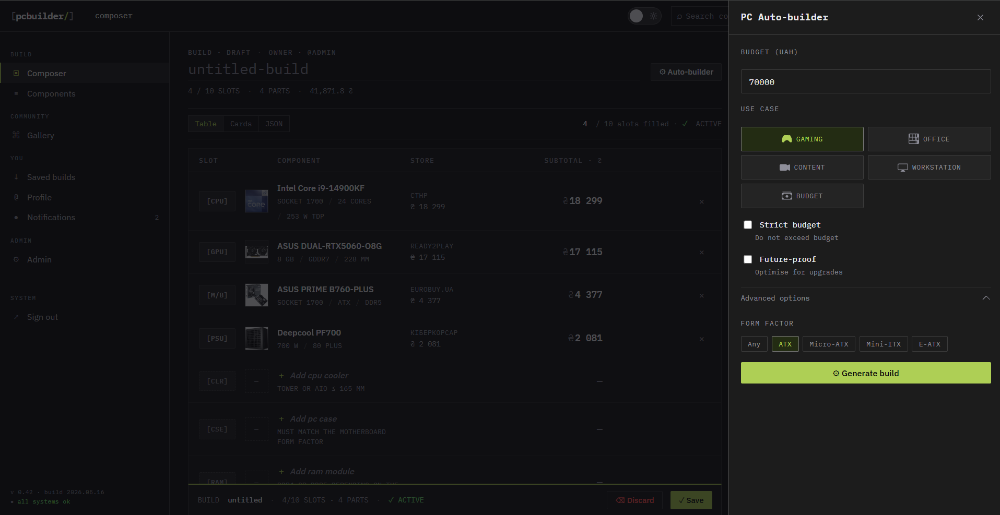

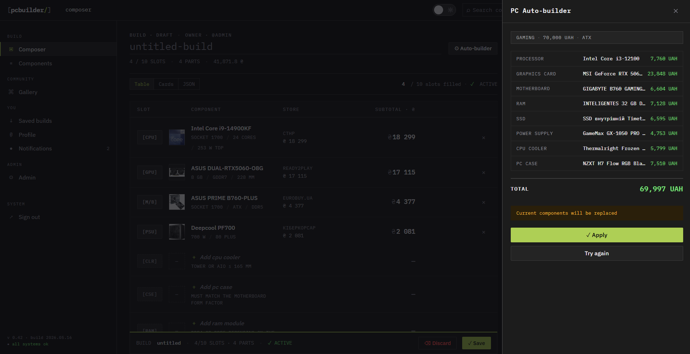

### Public Gallery
- Save builds and publish them to a public gallery.
- Browse, view build details, and report inappropriate builds for moderation.

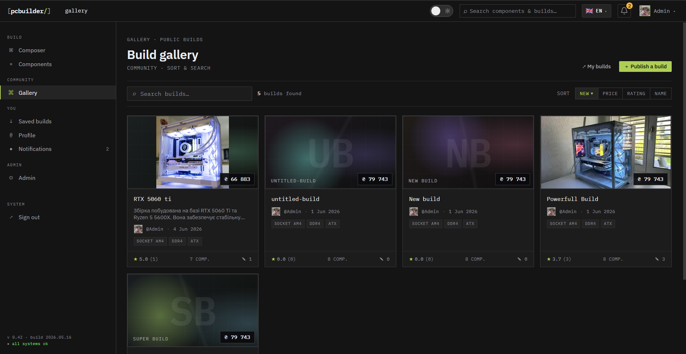

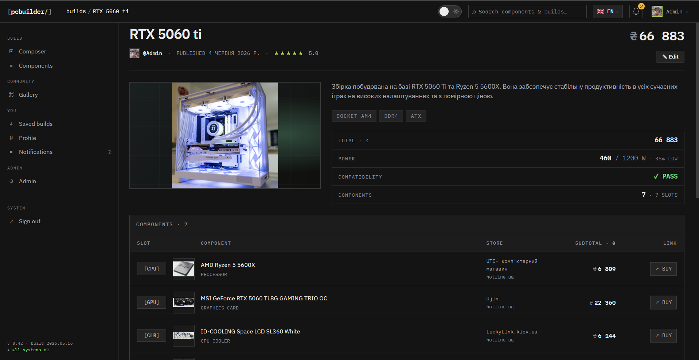

### Component Catalog
- Browse components by type with filtering and pagination.
- Detailed component pages including specs and price history.
- Global search across components and builds.

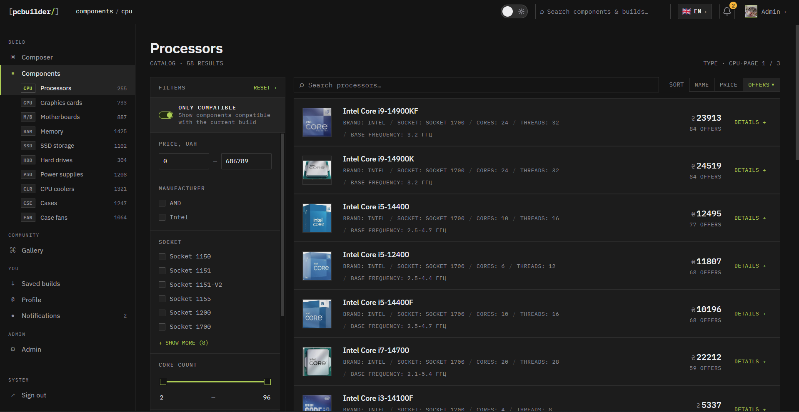

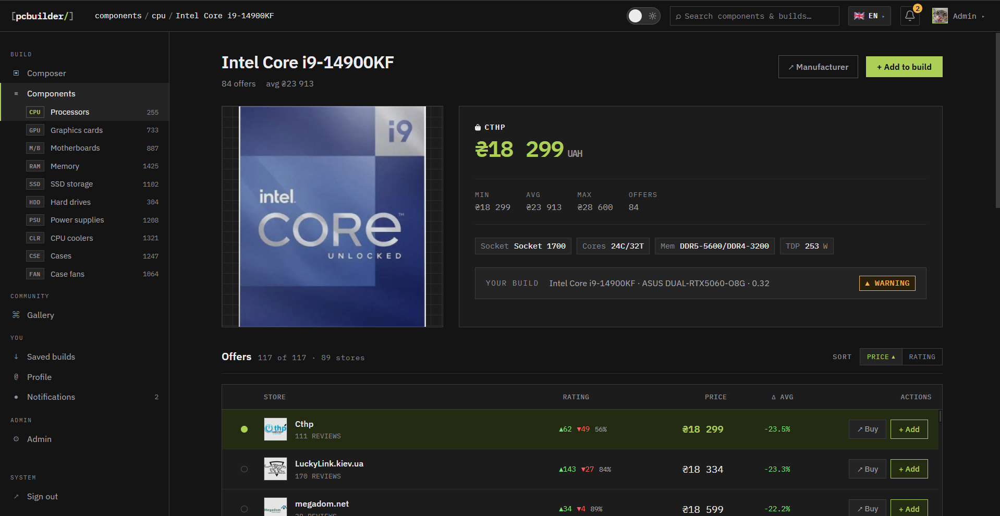

### Notifications & Price Alerts
- Subscribe to price alerts on individual components.
- Get notified when a tracked price drops, in real time via SignalR.
- In-app notification center plus a dedicated notifications page.

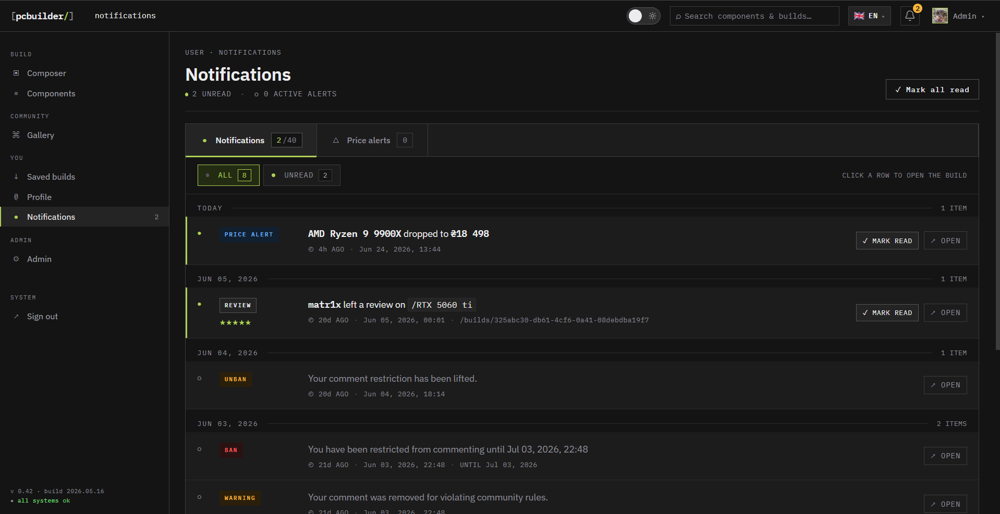

### Accounts & Auth
- Email/password registration with email verification and password reset.
- Google OAuth sign-in.
- JWT access tokens + refresh tokens.
- User profile with avatar, saved builds, and security settings.

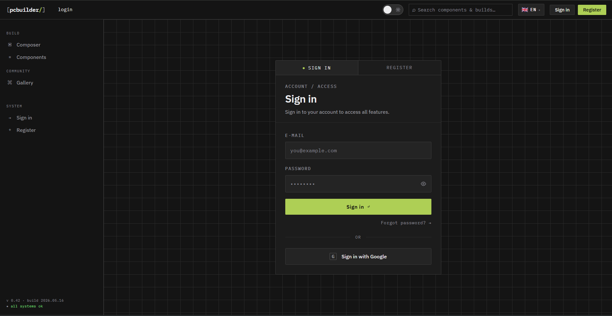

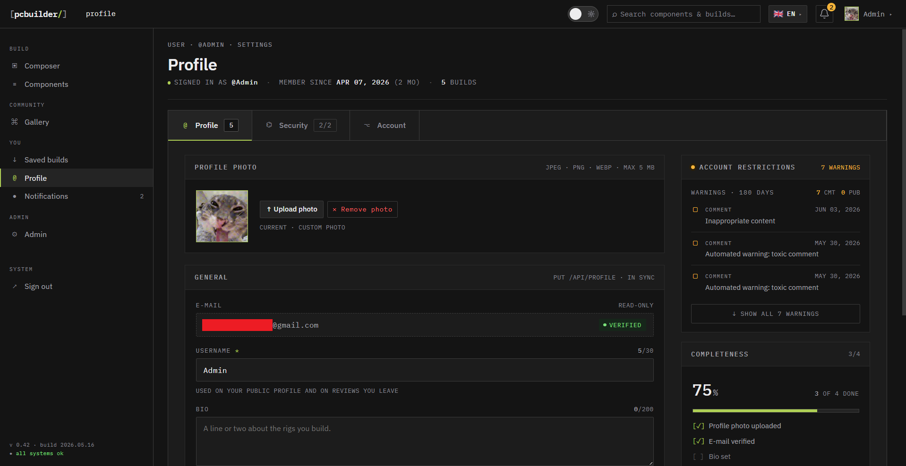

### Admin & Moderation
- Admin dashboard with users, moderation queue, and scraping management.
- Report-driven moderation of public builds.
- **ML text moderation** — user-generated text is screened by a transformer-based toxicity classifier (multilingual) before it goes public.

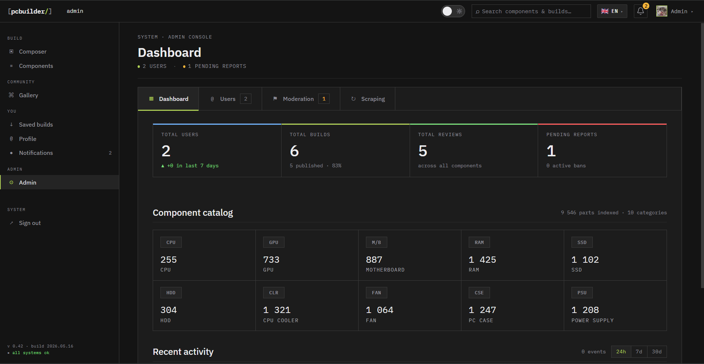

### Automated Scraping
- A background worker scrapes component data and prices from online stores.
- Scraping jobs are dispatched from the admin panel and processed asynchronously via RabbitMQ.

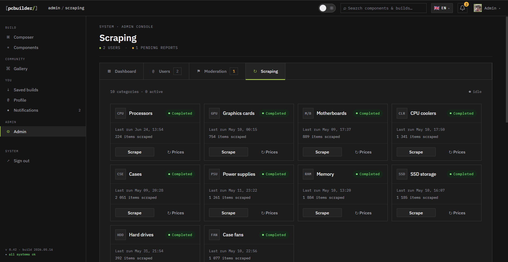

### Internationalization
- Multi-language UI via `i18next`.
- Server-side localization of scraped component data via Azure Translator.

---

## Tech Stack

| Layer | Technology |
|---|---|
| **Backend** | .NET 9 (C#), Clean Architecture modular monolith, MediatR, FluentValidation |
| **Frontend** | React 19 + TypeScript, React Router v7, Vite, Axios, Recharts, i18next |
| **Database** | SQL Server + EF Core |
| **Real-time** | SignalR |
| **Messaging** | RabbitMQ (scraping job queue) |
| **Storage** | Azure Blob Storage (Azurite emulator in dev) |
| **ML Moderation** | Python · FastAPI · PyTorch · Hugging Face Transformers |
| **Infra** | Docker / Docker Compose |

---

## Architecture

The backend is a **modular monolith** following **Clean Architecture**. Each bounded context is a module with three layers (`Domain` → `Application` → `Infrastructure`):

```
Auth · Components · PcBuilds · Scraping · Moderation · Notifications
```

Cross-cutting projects:
- **PcBuilder.Api** — controllers, middleware, SignalR hubs, `Program.cs`
- **PcBuilder.SharedKernel** — `Result<T>`, `Error`, validation & caching pipeline behaviors
- **PcBuilder.Persistence** — `ApplicationDbContext`, EF Core migrations
- **PcBuilder.ScraperWorker** — standalone worker consuming scraping jobs
- **TextModerationApi** — separate Python service for toxicity classification

### Request flow

```
HTTP request
  → Controller (sends a MediatR command/query)
  → ValidationBehavior (FluentValidation)
  → CachingBehavior (memory cache for queries)
  → Handler (business logic, returns Result<T>)
  → Controller maps Result<T> → IActionResult
```

Handlers always return a `Result<T>`; business errors are modeled as `Error` records rather than thrown exceptions.

### Auto-Builder & compatibility engine

The greedy auto-builder is composed of small, focused interfaces (scenario policy, candidate pruning, build assembly, cooler selection, mapping) so new behavior is added by implementing an interface rather than editing an orchestrator. Compatibility is enforced by a set of pluggable `ICompatibilityRule` implementations aggregated by a `CompatibilityChecker`.

---

## Getting Started

### Prerequisites
- [Docker](https://www.docker.com/) & Docker Compose
- (For local non-Docker development) [.NET 9 SDK](https://dotnet.microsoft.com/) and [Node.js](https://nodejs.org/)

### Run everything with Docker (recommended)

```bash
docker-compose up
```

This starts SQL Server, RabbitMQ, Azurite, the text-moderation service, the API, the scraper worker, and the frontend.

| Service | URL |
|---|---|
| Frontend | http://localhost:8080 |
| API | http://localhost:5000 |
| RabbitMQ management | http://localhost:15672 (guest / guest) |
| Text moderation API | http://localhost:8001 |

> **Configuration:** the compose file reads optional env vars such as `JWT_SECRET`, `SA_PASSWORD`, `VITE_GOOGLE_CLIENT_ID`, `AZURE_TRANSLATOR_KEY`, and `AZURE_TRANSLATOR_REGION`. Development defaults are provided, but set your own secrets for any real deployment.

### Run the backend locally (without Docker)

```bash
dotnet restore backend/backend.sln
dotnet build backend/backend.sln
dotnet run --project backend/PcBuilder.Api/PcBuilder.Api.csproj   # http://localhost:5000
```

### Run the frontend locally

```bash
cd frontend
npm install
npm run dev      # dev server on http://localhost:5173
npm run build    # production bundle
npm run lint     # ESLint
```

### Database migrations

```bash
# From repo root
dotnet ef migrations add <MigrationName> \
  --project backend/PcBuilder.Persistence \
  --startup-project backend/PcBuilder.Api

dotnet ef database update \
  --project backend/PcBuilder.Persistence \
  --startup-project backend/PcBuilder.Api
```

### Tests

```bash
dotnet test backend/PcBuilder.Tests/PcBuilder.Tests.csproj
```

---

## Project Structure

```
PcBuilder/
├── backend/
│   ├── Modules/                 # Bounded contexts (Auth, Components, PcBuilds, …)
│   │   └── <Module>/
│   │       ├── <Module>.Domain
│   │       ├── <Module>.Application
│   │       └── <Module>.Infrastructure
│   ├── PcBuilder.Api/           # Controllers, hubs, Program.cs
│   ├── PcBuilder.SharedKernel/  # Result<T>, Error, pipeline behaviors
│   ├── PcBuilder.Persistence/   # DbContext + EF migrations
│   ├── PcBuilder.ScraperWorker/ # Background scraping worker
│   └── PcBuilder.Tests/
├── frontend/                    # React 19 + TypeScript app
├── TextModerationApi/           # Python FastAPI toxicity classifier
└── docker-compose.yml
```

